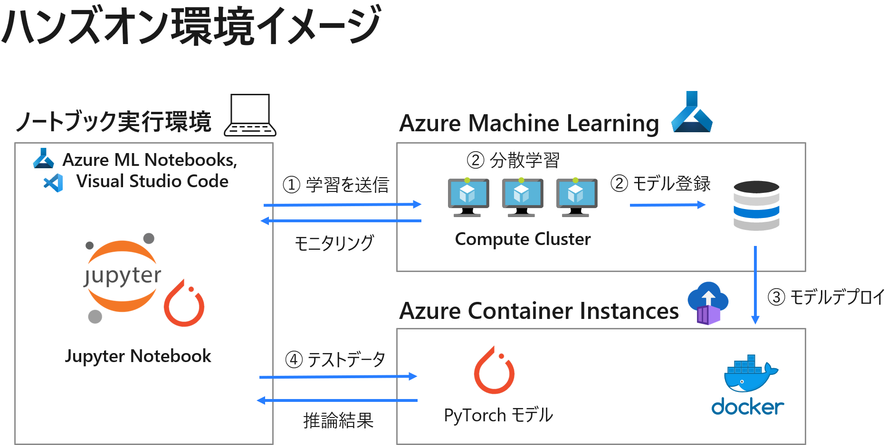
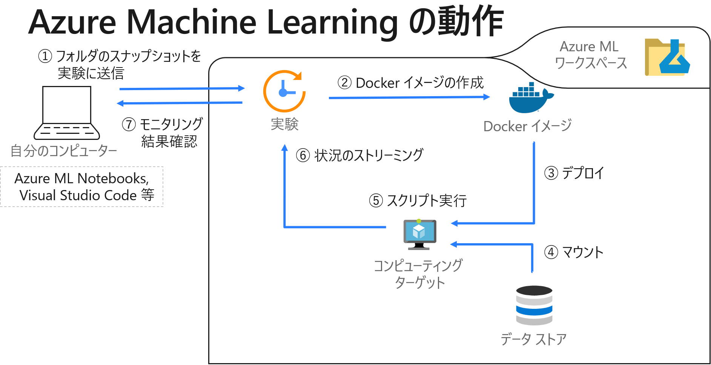

# Azure Machine Learningを使用した PyTorch モデルでの画像分類シナリオ

本コンテンツは、ローカルの Visual Studio Code (VSCode) 上から Azure Machine Learning を使用して PyTorch モデルでの画像分類を行うハンズオンコンテンツです。

  

## 対象者イメージ
Pythonや機械学習のライブラリを使ったことがあり、クラウド上での機械学習やAzure Machine Learningの利用に興味がある方。

## 前提条件
本ハンズオンコンテンツでは下記環境を前提としています。
- Azure アカウント
    - 有償アカウントでの参加を推奨します。[こちら](https://azure.microsoft.com/ja-jp/pricing/purchase-options/pay-as-you-go/)から取得ください。
    - 無償アカウントは [こちら](https://azure.microsoft.com/ja-jp/free/) から取得ください。
※ 無償アカウントはクォータの申請ができないため当日のハンズオンで作業できない部分があります
- [Azure Machine Learning ワークスペース作成](https://docs.microsoft.com/ja-jp/azure/machine-learning/how-to-manage-workspace?tabs=azure-portal)
- クォータ (Quota) が十分に存在すること
    理想的にはGPUインスタンスのクォーターが望ましいですが、CPUインスタンスでも動作確認を行った内容となっています。
    - 手順
        - [リージョンごとにクォータの引き上げを要求する](https://docs.microsoft.com/ja-jp/azure/azure-portal/supportability/regional-quota-requests#request-a-quota-increase-by-region-from-help--support)
    - 申請内容
        - クォータの種類：Machine Learning サービス
        - 場所：(Azure MLワークスペースと同一リージョン)
        - VMシリーズ：NC Series (又はNCSv3 Series等)
            ※CPUの場合：Standard DSv2 ファミリ
        - 新しい vCPU の制限：最低16以上

## 実行手順
本リポジトリを`git clone`するか、ZIPファイルとしてダウンロードしてご利用ください。

### 環境準備 (ローカル環境の場合)
`./setup.ipnb`を実行します。
Visual Studio Code等のローカル環境で本コンテンツを実行する際に必要です。Azure ML Notebooks上でノートブックを実行していく場合は実施頂く必要はございません。

### Azure MLでの学習とデプロイ (メインコンテンツ)
`./examples/02_pytorch_azureml.ipynb`を実行します。

## 参考情報
- [VSCode の Azure ML 拡張機能チュートリアル](https://docs.microsoft.com/ja-jp/azure/machine-learning/tutorial-setup-vscode-extension)
- [Azure Machine Learning を使用して PyTorch モデルを大規模にトレーニングする](https://docs.microsoft.com/ja-jp/azure/machine-learning/how-to-train-pytorch#distributeddataparallel)
- Horovod を使用した分散深層学習を行うサンプルノードブック
[Distributed PyTorch with Horovod](https://github.com/Azure/MachineLearningNotebooks/blob/master/how-to-use-azureml/ml-frameworks/pytorch/distributed-pytorch-with-horovod/distributed-pytorch-with-horovod.ipynb)
    ※本コンテンツでは分散学習を行うためにPyTorch の DistributedDataParallel 機能を使用しています。
- [Azure Machine Learningのサンプルノートブック集 (英語)](https://github.com/Azure/MachineLearningNotebooks)
    PyTorch以外のライブラリを使用した場合を含め、様々なシナリオについてのサンプルノートブックがまとめられています。
- [Machine Learng Practices and Tips](https://azure.github.io/machine-learning-best-practices/#/)

### 関連ノートブック
- PyTorch で MNIST を対象にした学習スクリプト [PyTorch Examples](https://github.com/pytorch/examples)
- モデル学習部分のノートブック参考
[Distributed PyTorch with DistributedDataParallel](https://github.com/Azure/MachineLearningNotebooks/blob/master/how-to-use-azureml/ml-frameworks/pytorch/distributed-pytorch-with-distributeddataparallel/distributed-pytorch-with-distributeddataparallel.ipynb)
- モデルデプロイ部分のノートブック参考
[Train, hyperparameter tune, and deploy with PyTorch](https://github.com/Azure/MachineLearningNotebooks/blob/master/how-to-use-azureml/ml-frameworks/pytorch/train-hyperparameter-tune-deploy-with-pytorch/train-hyperparameter-tune-deploy-with-pytorch.ipynb)
